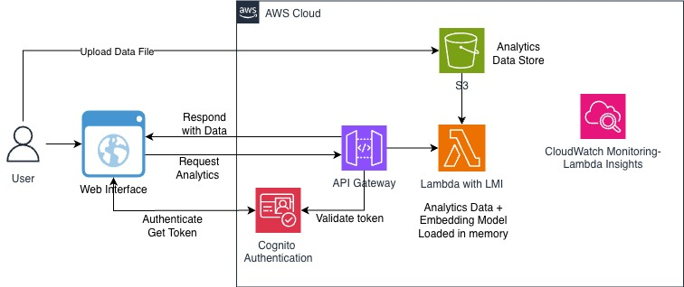

# AI-Powered Customer Analytics with Lambda Managed Instances

Advanced proof-of-concept demonstrating AWS Lambda with FastEmbed for AI-powered customer analytics using semantic search and in-memory processing with container image deployment.

## About this Project



This project showcases how to use AWS Lambda with AI/ML capabilities for real-time customer analytics:

- **AI-Powered Semantic Search**: Use FastEmbed (sentence-transformers) to find similar customers using natural language queries
- **In-Memory Analytics**: Load 1M+ customer sessions into Lambda memory for sub-second query performance
- **Container Image Deployment**: Deploy Lambda as container image to support large ML dependencies (FastEmbed + ONNX)
- **Customer Behavior Analysis**: Analyze individual customer engagement, conversion rates, and purchase patterns
- **Cohort Analysis**: Segment customers by device, country, age group with real-time filtering
- **Serverless ML**: Run ML models (all-MiniLM-L6-v2) directly in Lambda without separate inference endpoints

### Key Features

- **FastEmbed Integration**: Semantic search using sentence-transformers/all-MiniLM-L6-v2 model
- **Natural Language Queries**: Find customers like "high value customers" or "frequent browsers"
- **Real-Time Analytics**: Customer analysis, cohort segmentation, engagement scoring
- **High Performance**: 100-500ms query times including AI inference
- **Cost Effective**: LMI pricing with EC2 Savings Plans support, no separate ML infrastructure needed
- **Modern Web UI**: Interactive dashboard with semantic search interface
- **Container Image**: Supports up to 10GB image size (vs 250MB ZIP limit) - [See detailed container configuration →](CONTAINER_IMAGE_CONFIG.md)

## Performance & Optimization Features

### Multi-Concurrency Customer Analysis

The UI customer analysis feature supports analyzing multiple users simultaneously with true concurrency:

- **Multiple User IDs**: Enter multiple User IDs (comma or newline separated) in the UI
- **Separate Lambda Requests**: Each User ID is sent as a separate HTTP request to Lambda
- **Concurrent Execution**: With `PerExecutionEnvironmentMaxConcurrency: 2`, the Lambda execution environment can handle 2 concurrent requests simultaneously
- **Parallel Processing**: Multiple requests execute in parallel, significantly reducing total analysis time
- **Example**: Analyzing 10 users takes ~5-7 seconds instead of 20+ seconds with sequential processing

### Semantic Search Optimization

The semantic search feature uses advanced caching, sampling, and parallel processing techniques for optimal performance:

**Dataset Overview:**
- **Total Data**: 1 million transactions across 100,000 unique users stored in S3 Parquet format
- **In-Memory Processing**: Entire dataset loaded into Lambda memory for sub-second queries

**Embeddings Cache Pre-Generation:**
- **Sample Size**: 5,000 users (5% of total) selected during Lambda initialization
- **Stratified Sampling**: Ensures representative coverage across all customer types:
  - **40% High-Activity Users**: Customers with many sessions (top 25% by activity)
  - **40% Medium-Activity Users**: Average customers (middle 50% by activity)
  - **20% Low-Activity Users**: Infrequent visitors (bottom 25% by activity)
- **Why Stratified Sampling?**: Unlike random sampling which might miss rare customer types, stratified sampling guarantees that queries like "highly engaged customers" or "window shoppers" will find relevant matches in the cache
- **Cache Storage**: All 5,000 user embeddings (384-dimensional vectors) stored in Lambda memory (~8 MB)
- **Initialization Time**: Cache generation adds ~20-30 seconds to cold start but makes all subsequent searches instant

**Multithreading for Cache Pre-Generation:**
- **Behavior Description Generation**: Uses `ThreadPoolExecutor` with up to 20 worker threads to generate natural language descriptions for 5,000 users in parallel during initialization
- **Performance Impact**: Multithreading reduces cache generation time by ~60% (from ~50s to ~20s)
- **Thread Safety**: All operations use thread-safe data structures and immutable cached data
- **Note**: Semantic search queries themselves use sequential processing for optimal performance, as the overhead of threading exceeds the benefit for fast NumPy operations

**Performance Benefits:**
- **First Search**: <5 seconds (cache already exists from initialization)
- **Subsequent Searches**: <2 seconds (using cached embeddings with sequential similarity calculations)
- **High-Quality Matches**: 70-90% similarity scores for well-matched queries
- **No API Timeout**: Cache pre-generation happens during initialization, not during API requests

## Prerequisites

- AWS CLI configured with credentials
- SAM CLI installed (`sam --version`)
- Python 3.13+ installed locally
- **Docker or Finch** (required for container builds) - [Setup guide →](CONTAINER_IMAGE_CONFIG.md#troubleshooting)
- AWS account with appropriate permissions
- Supported regions: Check [AWS Lambda Managed Instances availability](https://docs.aws.amazon.com/lambda/latest/dg/lambda-managed-instances.html) for current region support

## Project Structure

```
sample-lambda-managed-instances-analytics/
├── setup-data.sh                  # Data generation + S3 upload script
├── deploy-lambda.sh               # SAM build + deploy script (also configures auth)
├── template.yml                   # SAM/CloudFormation template (Container Image)
├── generate_data_simple.py        # Data generation script
├── customer_analytics/
│   ├── Dockerfile                 # Container image definition
│   ├── app.py                     # Lambda function with FastEmbed
│   └── requirements.txt           # Python dependencies
└── ui/
    ├── index.html                 # Web dashboard
    ├── styles.css                 # UI styling
    ├── app.js                     # Frontend logic
    ├── config.js                  # Cognito config (auto-generated, gitignored)
    └── README.md                  # UI documentation
```

## Data Generation

The project includes a data generator that creates realistic customer behavioral data:

- **Script**: `generate_data_simple.py`
- **Default Output**: 1M rows (~8GB in memory when loaded)
- **Format**: Parquet (compressed, columnar storage)
- **Dependencies**: Only `pyarrow` (no pandas/numpy required for generation)

### Generated Data Schema

```
customer_transactions_1M_rows.parquet
├── user_id: Unique customer identifier (100k unique users)
├── timestamp: Session timestamp (ISO format)
├── session_duration: Time spent in seconds (30-1800)
├── pages_visited: Number of pages viewed (1-20)
├── products_viewed: Number of products viewed (0-10)
├── purchased: Boolean purchase flag (~10% conversion)
├── purchase_value: Purchase amount if purchased ($10-$500)
├── device: Device type (mobile, desktop, tablet)
├── age_group: Customer age group (18-24, 25-34, etc.)
└── country: Customer country (USA, UK, Canada, etc.)
```

## Deployment

### Option 1: Automated Deployment (Recommended)

The deployment is split into two scripts for better control:

#### Step 1: Data Setup (One-time)

Generate sample data and upload to S3:

```bash
chmod +x setup-data.sh deploy-lambda.sh
./setup-data.sh
```

This script will:
1. Create S3 bucket (if needed)
2. Set up Python virtual environment
3. Generate 1M rows of sample data
4. Upload data to S3
5. Display bucket name for next step

**Expected time**: 2-3 minutes

#### Step 2: Lambda Deployment

Build container image and deploy Lambda function:

```bash
./deploy-lambda.sh
```

This script will:
1. Verify data exists in S3
2. Build container image with FastEmbed (10-15 minutes first time)
3. Push to ECR (automatically created)
4. Deploy Lambda function and Cognito User Pool
5. Generate `ui/config.js` with Cognito settings
6. Prompt to create a test user
7. Display API endpoint and curl examples

**Expected time**: 15-20 minutes (first build), 5-10 minutes (subsequent builds)

For template-only changes (no container rebuild needed):

```bash
./deploy-lambda.sh --deploy-only
```

This skips S3 verification, ECR auth, and `sam build` — goes straight to `sam deploy` using saved config from `samconfig.toml`.

**Benefits of separate scripts:**
- Run data setup once, deploy Lambda multiple times
- Faster iteration during development
- Skip data generation if already uploaded

### Option 2: Manual Deployment

#### Step 1: Generate Data

```bash
# Install dependencies
python3 -m venv venv
source venv/bin/activate
pip install pyarrow

# Generate sample data
python3 generate_data_simple.py
deactivate
```

#### Step 2: Upload to S3

```bash
# Create S3 bucket
aws s3 mb s3://<your-bucket-name> --region us-east-1

# Upload data
aws s3 cp customer_transactions_1M_rows.parquet s3://<your-bucket-name>/
```

#### Step 3: Build Container Image

```bash
# Build (requires Docker or Finch running)
sam build
```

#### Step 4: Deploy Lambda

```bash
# Deploy with automatic ECR repository creation
sam deploy \
    --stack-name lmi-customer-analytics-with-llm \
    --region us-east-1 \
    --parameter-overrides \
        DataBucketName=<your-bucket-name> \
        FileName=customer_transactions_1M_rows.parquet \
        SubnetIds=<subnet-id-1>,<subnet-id-2> \
        SecurityGroupId=<security-group-id> \
    --capabilities CAPABILITY_IAM \
    --resolve-s3 \
    --resolve-image-repos \
    --guided

# Note: SubnetIds - recommend at least 2 subnets across AZs for resiliency
# SecurityGroupId must be from the same VPC as the subnets
```

### Step 5: Configure Authentication

If you used `deploy-lambda.sh`, this is already done — the script generates `ui/config.js` and prompts you to create a test user.

For manual deployment, generate the config file:

```bash
# Get stack outputs
COGNITO_DOMAIN=$(aws cloudformation describe-stacks \
    --stack-name lmi-customer-analytics-with-llm \
    --query 'Stacks[0].Outputs[?OutputKey==`CognitoDomain`].OutputValue' \
    --output text --region us-east-1)

COGNITO_CLIENT_ID=$(aws cloudformation describe-stacks \
    --stack-name lmi-customer-analytics-with-llm \
    --query 'Stacks[0].Outputs[?OutputKey==`CognitoClientId`].OutputValue' \
    --output text --region us-east-1)

# Strip https:// and create config.js
DOMAIN_BARE="${COGNITO_DOMAIN#https://}"
cat > ui/config.js << EOF
var COGNITO_DOMAIN = '${DOMAIN_BARE}';
var COGNITO_CLIENT_ID = '${COGNITO_CLIENT_ID}';
EOF
```

Create a test user:

```bash
USER_POOL_ID=$(aws cloudformation describe-stacks \
    --stack-name lmi-customer-analytics-with-llm \
    --query 'Stacks[0].Outputs[?OutputKey==`CognitoUserPoolId`].OutputValue' \
    --output text --region us-east-1)

aws cognito-idp admin-create-user \
    --user-pool-id $USER_POOL_ID \
    --username user@example.com \
    --temporary-password 'TempPass1!' \
    --region us-east-1

aws cognito-idp admin-set-user-password \
    --user-pool-id $USER_POOL_ID \
    --username user@example.com \
    --password 'YourPassword1!' \
    --permanent \
    --region us-east-1
```

### Managing Users

To add more users after deployment:

```bash
# Get User Pool ID (if not already set)
USER_POOL_ID=$(aws cloudformation describe-stacks \
    --stack-name lmi-customer-analytics-with-llm \
    --query 'Stacks[0].Outputs[?OutputKey==`CognitoUserPoolId`].OutputValue' \
    --output text --region us-east-1)

# Create a new user
aws cognito-idp admin-create-user \
    --user-pool-id $USER_POOL_ID \
    --username newuser@example.com \
    --temporary-password 'TempPass1!' \
    --region us-east-1

# Set permanent password
aws cognito-idp admin-set-user-password \
    --user-pool-id $USER_POOL_ID \
    --username newuser@example.com \
    --password 'NewUserPass1!' \
    --permanent \
    --region us-east-1

# List all users
aws cognito-idp list-users \
    --user-pool-id $USER_POOL_ID \
    --region us-east-1 \
    --query 'Users[*].[Username,UserStatus,Enabled]' \
    --output table

# Disable a user
aws cognito-idp admin-disable-user \
    --user-pool-id $USER_POOL_ID \
    --username user@example.com \
    --region us-east-1

# Delete a user
aws cognito-idp admin-delete-user \
    --user-pool-id $USER_POOL_ID \
    --username user@example.com \
    --region us-east-1
```

Password requirements: minimum 8 characters, must include uppercase, lowercase, number, and symbol.

### Step 6: Start the UI

```bash
cd ui
python3 -m http.server 8000
```

Open browser at `http://localhost:8000`, click "Sign In" to authenticate via Cognito hosted UI, then enter your API endpoint URL.

## Testing the API

All API endpoints require a valid Cognito JWT token in the `Authorization` header.

### Get API Endpoint and Auth Token

For CLI testing, the easiest way to get a token is to sign in via the UI and copy it from the browser console:

1. Sign in via the UI at `http://localhost:8000`
2. Open browser console (Cmd+Option+J)
3. Type `idToken` and copy the value

Then use it in curl:

```bash
TOKEN="<paste token here>"
```

Alternatively, get the API endpoint from stack outputs:

```bash
aws cloudformation describe-stacks \
    --stack-name lmi-customer-analytics-with-llm \
    --query 'Stacks[0].Outputs[?OutputKey==`ApiEndpoint`].OutputValue' \
    --output text
```

### Test Health Check

```bash
curl -H "Authorization: $TOKEN" \
  https://<api-id>.execute-api.us-east-1.amazonaws.com/prod/health
```

### Test Customer Analysis

```bash
curl -X POST https://<api-id>.execute-api.us-east-1.amazonaws.com/prod/analytics \
  -H "Content-Type: application/json" \
  -H "Authorization: $TOKEN" \
  -d '{
    "requestType": "customer_analysis",
    "userId": "user_000001"
  }'
```

### Test Semantic Search

The semantic search uses AI embeddings to find customers with similar behavioral patterns based on natural language queries.

**Example 1: High-value premium customers with mobile preference**

```bash
curl -X POST https://<api-id>.execute-api.us-east-1.amazonaws.com/prod/analytics \
  -H "Content-Type: application/json" \
  -H "Authorization: $TOKEN" \
  -d '{
    "requestType": "semantic_search",
    "query": "high-value premium customers with mobile preference and frequent purchases",
    "topN": 5
  }'
```

**Example 2: Window shoppers (browsers who rarely purchase)**

```bash
curl -X POST https://<api-id>.execute-api.us-east-1.amazonaws.com/prod/analytics \
  -H "Content-Type: application/json" \
  -H "Authorization: $TOKEN" \
  -d '{
    "requestType": "semantic_search",
    "query": "customers who browse frequently but rarely make purchases",
    "topN": 5
  }'
```

**Example 3: Engaged customers with high conversion**

```bash
curl -X POST https://<api-id>.execute-api.us-east-1.amazonaws.com/prod/analytics \
  -H "Content-Type: application/json" \
  -H "Authorization: $TOKEN" \
  -d '{
    "requestType": "semantic_search",
    "query": "highly engaged customers with excellent conversion rates",
    "topN": 5
  }'
```

**Example 4: At-risk customers with declining activity**

```bash
curl -X POST https://<api-id>.execute-api.us-east-1.amazonaws.com/prod/analytics \
  -H "Content-Type: application/json" \
  -H "Authorization: $TOKEN" \
  -d '{
    "requestType": "semantic_search",
    "query": "customers with declining engagement and low recent activity",
    "topN": 5
  }'
```

**More query ideas:**
- "budget-conscious shoppers who wait for deals"
- "loyal customers who visit regularly on desktop"
- "new customers with high potential"
- "customers who view many products but have short sessions"
- "tablet users with moderate spending patterns"

### Test Cohort Analysis

```bash
curl -X POST https://<api-id>.execute-api.us-east-1.amazonaws.com/prod/analytics \
  -H "Content-Type: application/json" \
  -H "Authorization: $TOKEN" \
  -d '{
    "requestType": "cohort_analysis",
    "filters": {
      "device": "mobile",
      "country": "USA"
    }
  }'
```

### Get System Info

```bash
curl -X POST https://<api-id>.execute-api.us-east-1.amazonaws.com/prod/analytics \
  -H "Content-Type: application/json" \
  -H "Authorization: $TOKEN" \
  -d '{"requestType":"system_info"}'
```

## Available Request Types

1. **customer_analysis** - Analyze individual customer behavior
   - Parameters: `userId` (required)
   - Returns: Metrics, engagement score, AI-generated segment, recent activity

2. **semantic_search** - AI-powered customer search
   - Parameters: `query` (required), `topN` (optional, default 5)
   - Returns: Similar customers ranked by semantic similarity

3. **cohort_analysis** - Segment analysis with filters
   - Parameters: `filters` (optional: device, country, age_group)
   - Returns: Cohort metrics, distributions, conversion rates

4. **system_info** - System status and initialization info
   - Parameters: None
   - Returns: Data loaded status, model info, memory usage, cache status

## Performance Metrics

**Expected Results:**
- Cold start: 30-90 seconds (loading data + initializing FastEmbed model)
- Warm queries: 100-500ms per query (including AI inference)
- Memory usage: 10-14GB (out of 32GB allocated)
- Model: sentence-transformers/all-MiniLM-L6-v2 (384-dimensional embeddings)
- Container image size: ~1.5-2GB (compressed)

**AI Model Performance:**
- Embedding generation: ~50ms per customer description
- Semantic search: ~200ms for 1000 cached embeddings
- Customer segmentation: Real-time with AI-generated labels

## Container Image Details

> **For detailed container configuration, build process, and troubleshooting, see [CONTAINER_IMAGE_CONFIG.md](CONTAINER_IMAGE_CONFIG.md)**

**Why Container Image?**
- FastEmbed + dependencies = ~185MB
- Pandas layer = ~157MB
- **Total = ~342MB > 250MB ZIP limit**
- Container images support up to 10GB

**Build Process:**
1. Base image: `public.ecr.aws/lambda/python:3.13`
2. Install build tools: gcc, gcc-c++, cmake
3. Install Python dependencies: pandas, numpy, pyarrow, boto3, fastembed, onnxruntime, psutil
4. Pre-download FastEmbed model during build
5. Copy Lambda function code
6. Push to ECR (automatically created by SAM)

## Cleanup

### Delete Everything

```bash
# Stop the UI server (if running)
# Press Ctrl+C in the terminal where the server is running

# Delete SAM stack
sam delete --stack-name lmi-customer-analytics-with-llm --region us-east-1

# Delete S3 bucket and contents
aws s3 rm s3://<bucket-name>/ --recursive
aws s3 rb s3://<bucket-name>/

# Delete ECR repository (container images)
aws ecr describe-repositories --region us-east-1 | grep lmi-customer-analytics-with-llm

aws ecr delete-repository \
    --repository-name <repository-name> \
    --region us-east-1 \
    --force
```

### Delete Local Files

```bash
# Remove generated data
rm customer_transactions_1M_rows.parquet

# Remove virtual environment
rm -rf venv/

# Remove SAM build artifacts
rm -rf .aws-sam/
```

## Troubleshooting

For troubleshooting guidance refer to [TROUBLESHOOTING.md](TROUBLESHOOTING.md)

## Technologies Used

- **AWS Lambda** - Serverless compute with container image support
- **Lambda Managed Instances (LMI)** - Capacity provider with VPC networking
- **Amazon ECR** - Container registry for Lambda images
- **FastEmbed** - Lightweight embedding library (sentence-transformers)
- **ONNX Runtime** - Optimized ML inference
- **API Gateway** - REST API with CORS, X-Ray tracing, and access logging
- **AWS KMS** - Encryption for Lambda environment variables and CloudWatch Logs
- **Amazon Cognito** - User authentication for API Gateway endpoints
- **S3** - Data storage (Parquet files)
- **CloudFormation/SAM** - Infrastructure as Code
- **Python 3.13** - Lambda runtime
- **Pandas/NumPy** - Data analytics (in container)
- **PyArrow** - Parquet file handling
- **Docker/Finch** - Container build runtime
- **Vanilla JavaScript** - Frontend (no frameworks)

## Security Features

- **Cognito Authentication**: All API endpoints protected by Amazon Cognito User Pool authorizer; requests require a valid JWT token in the `Authorization` header
- **CORS Restriction**: API Gateway and Lambda responses restrict cross-origin access to `http://localhost:8000` only
- **API Throttling**: API Gateway rate limited to 5 requests/second (burst 10) to prevent financial DoS
- **KMS Encryption**: Lambda environment variables encrypted at rest with a dedicated KMS key (auto-rotating)
- **CloudWatch Logs Encryption**: API Gateway access logs encrypted with KMS
- **Scoped IAM Policies**: CloudWatch Logs permissions scoped to `/aws/lambda/*`; EC2 networking actions use `*` only where required by AWS
- **Non-Root Container**: Dockerfile runs as UID 1001, not root
- **API Gateway Access Logging**: All API requests logged to CloudWatch with structured JSON format
- **X-Ray Tracing**: Enabled on API Gateway for request tracing and debugging
- **Concurrency Control**: Lambda concurrency managed via `PerExecutionEnvironmentMaxConcurrency: 2` on the capacity provider (LMI does not support `ReservedConcurrentExecutions`)

## Use Cases

- **Customer Similarity**: Find customers with similar behavior patterns
- **Churn Prediction**: Identify at-risk customers using AI segmentation
- **Personalization**: Group customers for targeted campaigns
- **Anomaly Detection**: Find unusual customer behavior patterns
- **Product Recommendations**: Identify customer segments for specific products
- **Marketing Optimization**: Target high-value customer segments

## Contributors

[](https://github.com/aws-samples/sample-lambda-managed-instances-analytics/graphs/contributors)

## License

This project is licensed under the Apache-2.0 License.

## Support

For issues or questions, please refer to:
- [AWS Lambda Documentation](https://docs.aws.amazon.com/lambda/)
- [SAM Documentation](https://docs.aws.amazon.com/serverless-application-model/)
- [FastEmbed Documentation](https://qdrant.github.io/fastembed/)
- [Lambda Container Images](https://docs.aws.amazon.com/lambda/latest/dg/images-create.html)
